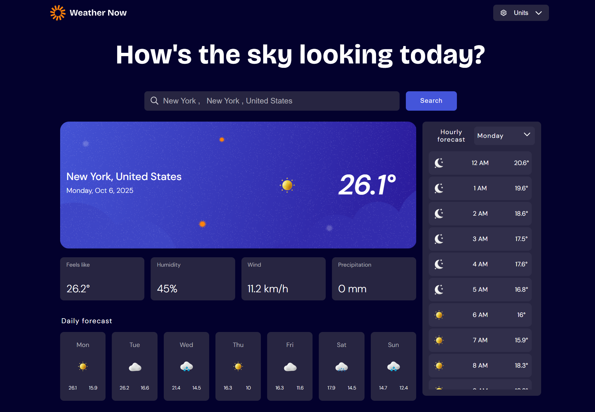

# Frontend Mentor - Weather app solution

This is a solution to the [Weather app challenge on Frontend Mentor](https://www.frontendmentor.io/challenges/weather-app-K1FhddVm49). Frontend Mentor challenges help you improve your coding skills by building realistic projects.

## Table of contents

- [Overview](#overview)
  - [The challenge](#the-challenge)
  - [Screenshot](#screenshot)
  - [Links](#links)
- [My process](#my-process)
  - [Built with](#built-with)
  - [What I learned](#what-i-learned)
  - [Continued development](#continued-development)
  - [Useful resources](#useful-resources)
- [Author](#author)
- [Acknowledgments](#acknowledgments)

## Overview

### The challenge

Users should be able to:

- Search for weather information by entering a location in the search bar
- View current weather conditions including temperature, weather icon, and location details
- See additional weather metrics like "feels like" temperature, humidity percentage, wind speed, and precipitation amounts
- Browse a 7-day weather forecast with daily high/low temperatures and weather icons
- View an hourly forecast showing temperature changes throughout the day
- Switch between different days of the week using the day selector in the hourly forecast section
- Toggle between Imperial and Metric measurement units via the units dropdown
- Switch between specific temperature units (Celsius and Fahrenheit) and measurement units for wind speed (km/h and mph) and precipitation (millimeters) via the units dropdown
- View the optimal layout for the interface depending on their device's screen size
- See hover and focus states for all interactive elements on the page

### Screenshot



### Links

- Solution URL: [Add solution URL here](https://your-solution-url.com)
- Live Site URL: [Add live site URL here](https://your-live-site-url.com)

## My process

### Built with

- Semantic HTML5 markup
- CSS custom properties
- Flexbox
- CSS Grid
- Vanilla JS
- Functional Javascript
- SVG Animations

### What I learned

Through this project I refreshed my knowledge on Fundamentals of HTML, CSS, JS. I also gained new insights while working with SVGs and realised the usefulness of SVG Animations.

```html
<div class="unit-selector-menu">
  <button>
    <svg
      xmlns="http://www.w3.org/2000/svg"
      width="16"
      height="16"
      fill="none"
      viewBox="0 0 16 16"
    >
      <path
        fill="#fff"
        d="M14.125 7.406c.031.407.031.813 0 1.188l1 .594a.74.74 0 0 1 .344.843c-.344 1.313-1.063 2.5-2 3.469-.25.219-.625.281-.906.125l-1-.594c-.25.188-.72.469-1.032.594v1.156a.733.733 0 0 1-.562.719A7.765 7.765 0 0 1 6 15.5c-.313-.063-.563-.406-.563-.719v-1.156a5.54 5.54 0 0 1-1.03-.594l-1 .594c-.282.156-.657.094-.907-.125-.938-.969-1.656-2.156-2-3.469a.74.74 0 0 1 .344-.844l1-.593c-.032-.156-.032-.406-.032-.594 0-.156 0-.406.032-.594l-1-.562A.74.74 0 0 1 .5 6c.344-1.313 1.063-2.5 2-3.469.25-.219.625-.281.906-.125l1 .594c.25-.188.719-.469 1.032-.594V1.25c0-.344.218-.625.562-.719a7.766 7.766 0 0 1 3.969 0c.312.063.562.406.562.719v1.156c.313.125.781.406 1.031.594l1-.594c.282-.156.657-.094.907.125.937.969 1.656 2.156 2 3.469a.74.74 0 0 1-.344.844l-1 .562Zm-1.656 2c.25-1.312.25-1.469 0-2.781l1.375-.781c-.188-.563-.688-1.375-1.063-1.813l-1.375.782c-.969-.844-1.125-.938-2.375-1.375V1.843C8.75 1.812 8.281 1.75 8 1.75c-.313 0-.781.063-1.063.094v1.593c-1.25.438-1.375.532-2.375 1.376L3.188 4.03c-.468.532-.812 1.157-1.062 1.813l1.375.781c-.25 1.313-.25 1.469 0 2.781l-1.375.781c.188.563.688 1.376 1.063 1.813l1.374-.781c.97.844 1.125.937 2.375 1.375v1.594c.282.03.75.093 1.063.093.281 0 .75-.062 1.031-.094v-1.593c1.25-.438 1.375-.531 2.375-1.375l1.375.781c.375-.438.875-1.25 1.063-1.813l-1.375-.78ZM8 5c1.625 0 3 1.375 3 3 0 1.656-1.375 3-3 3a3 3 0 0 1-3-3c0-1.625 1.344-3 3-3Zm0 4.5A1.5 1.5 0 0 0 9.5 8c0-.813-.688-1.5-1.5-1.5A1.5 1.5 0 0 0 6.5 8c0 .844.656 1.5 1.5 1.5Z"
      />
    </svg>
    <span>Units</span>
    <svg
      class="w-6 h-6 text-gray-800 dark:text-white"
      aria-hidden="true"
      xmlns="http://www.w3.org/2000/svg"
      width="24"
      height="24"
      fill="none"
      viewBox="0 0 24 24"
    >
      <path
        stroke="currentColor"
        stroke-linecap="round"
        stroke-linejoin="round"
        stroke-width="2"
        d="m19 9-7 7-7-7"
      />
    </svg>
  </button>
</div>
```

```css
.loader-container {
  grid-row: 1/2;
  grid-column: 1/1;
}

.loader-container ~ span {
  align-self: flex-start;
  text-align: center;
}

.loader-container > span {
  width: 100px;
  height: 100px;
  display: flex;
  justify-content: center;
  align-items: end;
}

.loader-container > span > svg {
  height: 20px;
  aspect-ratio: 1/1;
  fill: var(--neutral-300);
  animation: loader 0.6s ease-in-out infinite;
}

. .loader-container svg:nth-child(1) {
  animation-delay: 0s;
}

.loader-container svg:nth-child(2) {
  animation-delay: 0.2s;
}

.loader-container svg:nth-child(3) {
  animation-delay: 0.4s;
}

@keyframes loader {
  0% {
    transform: translateY(0);
  }
  50% {
    transform: translateY(-20px);
  }
  100% {
    transform: translateY(0);
  }
}
```

```js
const cities = {
  citiesFound: [],
  getCitiesByName: async function getCitiesByName(cityName) {
    try {
      const geocodingAPIURL = `https://nominatim.openstreetmap.org/search?format=json&city=${encodeURIComponent(
        cityName
      )}&addressdetails=1`;
      const coordsResponse = await fetch(geocodingAPIURL);

      if (!coordsResponse.ok) {
        console.error("Error fetching coordinates:", coordsResponse.statusText);
        return;
      }
      const cities = await coordsResponse.json();
      this.citiesFound = cities;
    } catch (err) {
      console.error("Error fetching cities:", err);
      errorLoadingState.setErrorPage();
    }
  },
  selectedCity: null,
};
```

### Continued development

For further developments in ths App, I would consider integrating location based automatic weather forecasting feature and allow users to view and compare past weather conditions.

### Useful resources

- [MDN](https://developer.mozilla.org/en-US/) - This helped me for proper in-depth research the features in HTML, CSS, JS.
- [Clippy](https://bennettfeely.com/clippy/) - This website helped me to create proper SVGs easily.


## Author

- Website - [Purushartha Singh Thakur](https://www.your-site.com)
- Frontend Mentor - [@yourusername](https://www.frontendmentor.io/profile/yourusername)

## Acknowledgments

I would like to thank my family for their support and the Frontend Mentors community for this opportunity.
